网络层次模型：4层，7层

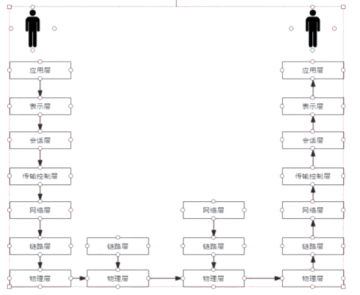

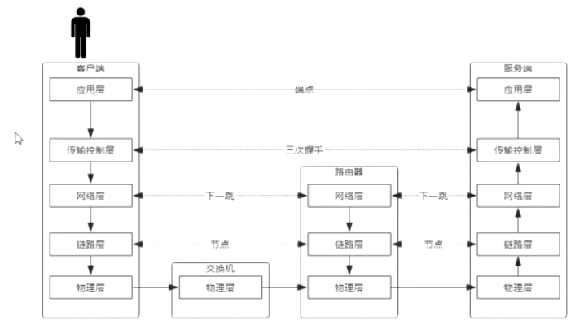

三次握手--->数据传输--->四次分手，是tcp建立连接及传输数据的最小粒度

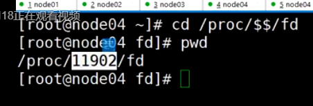

$$:表示当前bash进程的id,fd表示文件描述符

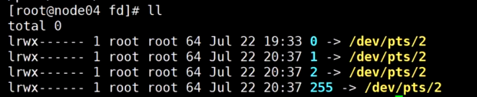

0表示输入，1表示输出，2表示错误输出

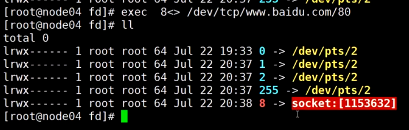exec 8<> 表示创建一个输入输出的文件描述符，

exec 8<>  /dev/tcp/www.baidu.com/80 表示和百度建立一个套接字连接

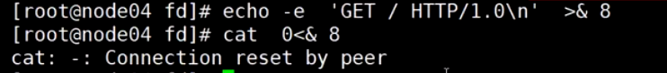

echo 回显， -e表示把\n替换为换行，'GET / HTTP/1.0\n' 表示GET请求，资源路径为/,协议为HTTP/1.0

\> 表示重定向，>& 表示将字符串重定向到一个文件描述符

echo -e  'GET / HTTP/1.0\n'  >&8 表示向百度发起一个Get请求

cat 0<& 8  从文件描述符读取并显示百度的响应,0表示输入

netstat :  显示整个 Linux 系统的网络情况 

- -n或--numeric 直接使用IP地址，而不通过域名服务器。
- -a或--all 显示所有连线中的Socket。
- -t或--tcp 显示TCP传输协议的连线状况。
- -p或--programs 显示正在使用Socket的程序识别码和程序名称。

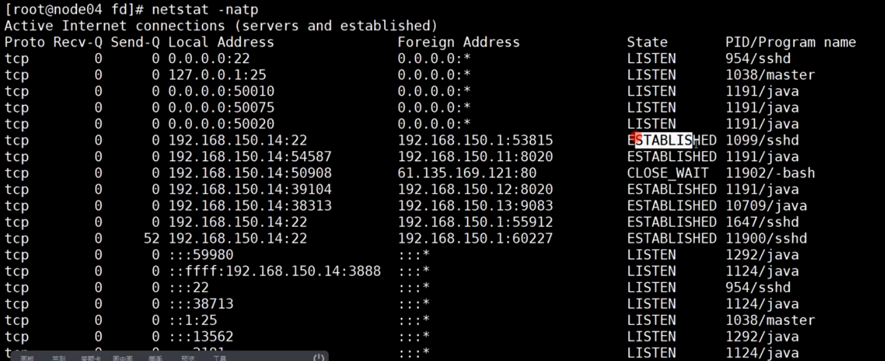

微服务：service mesh

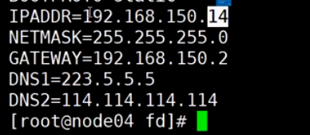

ip地址和子网掩码进行与运算：得到网络号 192.168.150.0

route -n 查看路由表：

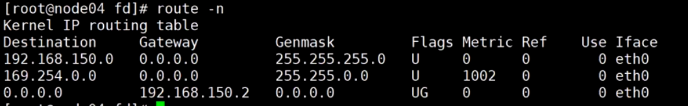

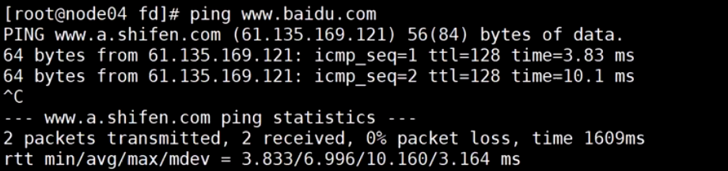

访问百度的过程：首先，通过dns服务器获取百度的ip地址，再拿ip地址跟路由表匹配，匹配的规则为ip与子网掩码按位与运算，运算结果和Destination匹配，最终匹配到0.0.0.0,对应的网关地址为192.168.150.2,然后数据包被转发到192.168.150.2,转发时数据包外面再包装一层网关的mac地址，网关拿到数据包，将数据包的mac地址改成下一跳的mac地址继续转发，最终到达百度服务器

arp -a 查看mac地址：

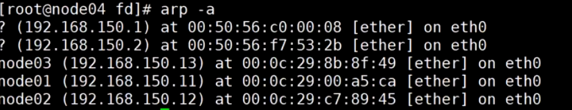

TCP/IP协议：基于下一跳的机制，ip是端点间的，mac是节点间的