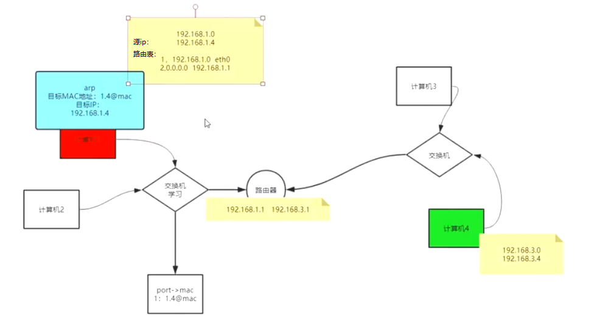

交换机：接同一网络，

路由器：可以接不同的网络,路由转发，判定,并且有交换功能

同一网络中ip地址不能重复

计算机启动后，通过arp协议获取局域网内除了本机之外的所有主机的mac地址

发送arp包：源mac地址为自己的mac地址，目标mac地址为FFFFFFFF,目标Ip:192.168.1.1,发送给交换机后，交换机发现mac地址为全F，向局域网广播这个数据包，收到的机器会匹配自己的ip地址，如果不匹配则丢弃该消息，如果匹配则回应自己的mac地址（这时候目标mac地址为发送该消息的机器的mac地址，源mac地址为自己的mac地址，目标ip为发送该消息的机器ip）

交换机：有学习能力，记录port->mac地址的映射关系,当arp数据包经过交接机，交换机会记录下port->mac信息

如上图，假如有两个路由器，路由器1其中有4.1的网口可以直连路由器2(4.2网口)，另外还有3.1网口，路由器2有4.2网口和8.1网口,那么如果要实现3.2机器到8.2机器的通信，路由器1应该有个路由条目8.0 ->4.2(即走4.2网口可以到达8.0网络),数据包首先从3.2机器到达路由器1的3.1网口，然后通过路由判定，找到8.0->4.2的路由条目，而要到达4.2网口可以通过4.1网口发出去，这样数据包到达路由器2，路由器2经由8.1网口发送数据包到8.0网络，最终数据包到达8.2机器

实验：准备两台机器，1和2号机器，1号机器有网卡192.168.150.13,192.168.88.88(掩码是24),

2号机器有网卡192.168.150.14,尝试在2号机器ping通192.168.88.88

删除路由条目：

本地电脑访问百度的过程：

NAT:network address transport 网路地址转换

前提：路由器已经接入网络供应商(ISP)，ISP会为路由器分配一个公网ip

假设本地电脑的ip为192.168.1.6,请求百度的首页，则数据包中的目标ip为百度ip，源ip为本机ip(192.168.1.6),本地的端口为随机端口(假设是12121),目标端口为80，数据包的源mac地址为本机mac地址，目标mac地址为下一跳的mac地址(路由器对应的mac地址),根据路由规则，数据包的下一跳应该是路由器(本机有一条路由规则匹配到192.168.1.1,即路由器的ip),数据包首先到达路由器，路由器检查目标mac地址发现和自己匹配，则接受该数据包，并将源ip和端口替换为路由器自己的ip(公网ip)和端口(假设端口为321),并记录路由器的ip和端口到本机ip和端口的映射关系，根据路由规则，数据包的下一跳是ISP服务器，因此数据包的目标mac地址被更改为ISP服务器的mac地址，源mac地址改为路由器自己的mac地址，数据包发送给ISP服务器，ISP服务器再通过Internet将数据包发送到百度服务器，百度服务器收到数据包，给客户端返回响应数据包，源ip为百度ip，目标ip为路由器的公网ip，源端口为百度的端口80，目标端口为路由器的端口321,数据包经过ISP服务器，将数据包发送给路由器，路由器匹配到自己的ip和端口，根据路由器和本机的ip端口映射关系表，将自己的ip和端口转换为本机的ip和端口，再讲数据包发给本地电脑，本地电脑成功接收到百度返回的数据包。

### LVS 负载均衡服务器

##### LVS  vs  tomcat服务器

>  tomcat慢的原因：tomcat位于应用层，需要走完7层网络协议，并且需要和client三次握手建立连接
>
> nginx:需要走完7层网络协议，需要和client握手，解析url，然后转发请求到真实服务器
>
> LVS (负载均衡服务器)快的原因：只需要走网路协议中的四层，只是转发数据包,不和client握手

##### D-NAT模式(目标ip转换)

首先服务器对外暴露的是LVS的ip(VIP),当client访问时，通过VIP访问LVS，LVS将VIP和端口转换为某台真实服务器的RIP和端口，并将数据包发送真实服务器，由真实服务器和客户端建立连接，并返回数据包至LVS，LVS将源ip地址RIP转换为VIP,再将数据包发送给客户端。

名词：

CIP:客户端ip，VIP:虚拟ip，DIP:分发ip，RIP:真实ip

D-NAT的缺点：非对称，带宽称为瓶颈，消耗算力

##### DR模式

采用的是mac地址欺骗

