#### LVS隧道模式 TUN

为了解决真实服务器和LVS不在一个局域网的情况，对发往真实服务器的数据包外面再包装一层ip(ip为RIP)，当真实服务器接收到数据包，

将外面的包裹拆掉，就可以正常处理客户端请求了，VPN也是基于这个原理

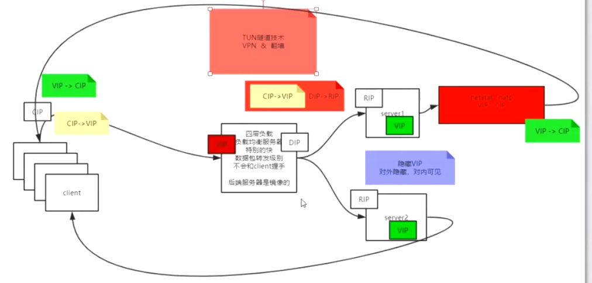

#### LVS的DR模型试验搭建

##### 负载均衡调度算法（LVS）

1.轮询调度（Round-Robin,RR）

2.带权重的轮询调度（Weighted Round-Robin,WRR）

3.最小连接调度（Least-Connection, LC）

4.带权重的最小连接调度（Weight Least-Connection, WLC）

5.基于局部性的最小连接调度（Locality-Based Least Connection, LBLC）

6.带复制的基于局部性最小连接调度（Locality-Based Least Connections with Replication, LBLCR）

7.目标地址散列调度（Destination Hashing, DH）

8.源地址散列调度（Source Hashing, SH）

##### ARP协议

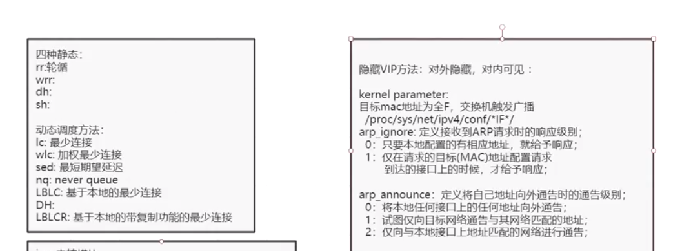

Linux中把网络设备，进程抽象成为文件，/proc代表进程或者内核所映射出来的目录，/sys代表系统，net代表网络，ipv4代表ipv4协议，\*IF\*代表接口

当修改文件的内容时，相当于修改内核空间的参数或者进程内变量的参数

这个目录下的文件不能使用vi命令修改，原因是vi会产生临时文件，而创建临时文件相当于是在内核空间新增变量，这个操作是不允许的

一块网卡可以配置多个ip地址

arp_ignore:

>0:只要本地配置的有相应地址，就给予响应；比如本地有多个网卡，配置了多个ip，只要是这几个ip中的ip，就返回mac地址
>
>1:仅在请求的目标(mac)地址配置请求到达的接口上的时候，才给予响应；比如本地有多个网卡，配置了多个ip，请求是从网卡1过来的，并且ip地址也匹配，才返回mac地址,如果请求的ip位于网卡2，不会给予响应

arp_announce:

>0:将本地任何接口上的任何地址向外通告; 比如本地有多个网卡，每个网卡上配置了多个ip，请求其中一个ip的mac地址时，返回本地所有的ip的mac地址
>
>1.试图仅向目标网络通告与其网络匹配(网络号相同)的地址;比如本地有多个网卡，每个网卡上配置了多个ip，则返回本地与请求的网络匹配的所有ip的mac地址
>
>2.仅向与本地接口上地址匹配的网络进行通告; 比如本地有多个网卡，每个网卡上配置了多个ip，如果请求的是网卡1，网卡1有两个ip，请求的是ip1，则只返回请求ip1的mac地址，不会返回ip2和mac的映射关系

##### 网卡

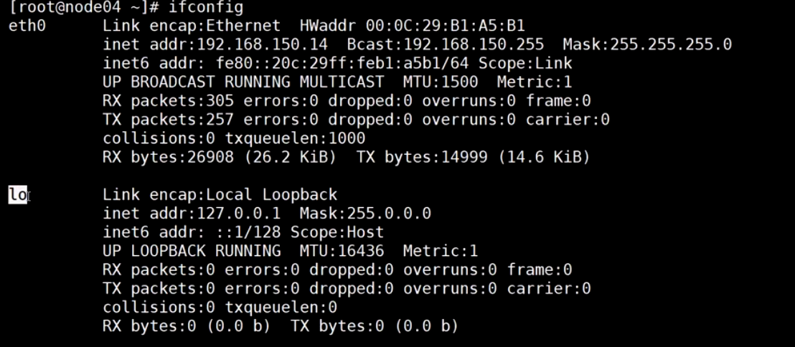

eth0:物理网卡

lo:虚拟网卡，环回设备,localhost(域名),127.0.0.1,lo网卡不会和外界连通，外界的数据包只能到达物理网卡

**lo网卡是对外隐藏对内可见**

**任何的网络接口(网卡)都可以有子接口**

虚拟网卡的使用:假设本地有Tomcat服务绑定在8080端口,通过浏览器访问tomcat的过程：

浏览器会将请求的数据包发送给操作系统内核，内核做路由判定，ip地址匹配到lo这块网卡，内核将数据包写入lo网卡，lo网卡并不会通过网线向外发送数据包，而是将输出的数据包转换为输入的数据包，输入的数据包被操作系统接收后，根据数据包的端口匹配到Tomcat服务，操作系统将数据包交给Tomcat，Tomcat返回响应的数据包，数据包再经由lo网卡发送给浏览器

##### VIP绑定到真实服务器，对外隐藏对内可见

将vip绑定到lo接口，作为lo的子接口

##### LVS调度算法

静态调度算法：

> rr 轮询  第一个请求负载给第一台服务器，第二个请求负载给下一台服务器，依次类推
>
> wrr 加权轮询，权重高的真实服务器被负载更多
>
> dh
>
> sh

动态调度算法：

> Lc 最少连接  将请求负载给连接少最少的真实服务器
>
> wlc 加权最少连接
>
> sed 最短期望延迟
>
> nq(never queue)
>
> LBLC 基于本地的最少连接
>
> DH
>
> LBLCR 基于本地的带复制功能的最少连接

问题：LVS怎么才能知道每个真实服务器的维护了哪些连接

```
client发送请求到LVS,LVS通过偷窥数据包的内容，发现SYNC标记，则认为客户端请求第一次握手，然后将数据包负载给一台真实服务器，并记录下了客户端请求负载给了哪台真实服务器，真实服务器的响应数据SYNC+ACK包经过(D-NAT)或者不经过(DR)LVS服务器返回给客户端,客户端进行第三次握手经过LVS返回ACK给真实服务器，LVS偷窥到这个数据包后，则认为客户端和真实服务器已经建立了连接，当客户端和真实服务器断开连接则发送挥手的数据包，当LVS收到客户端挥手的数据包后，将连接数减1
```


linux自带LVS模块:ipvs内核模块

ipvsadm: ipvs的客户端，可以用来控制ipvs参数

yum install ipvsadm -y

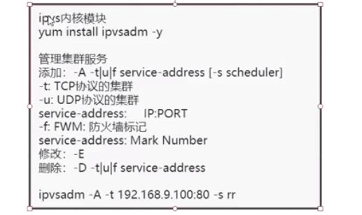

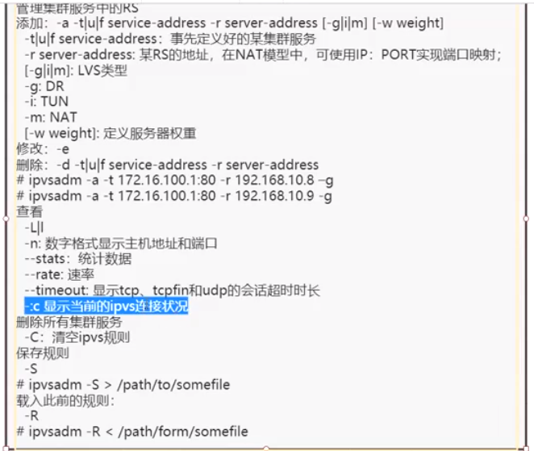

-A:添加，-s 指定调度规则

##### 实验手册

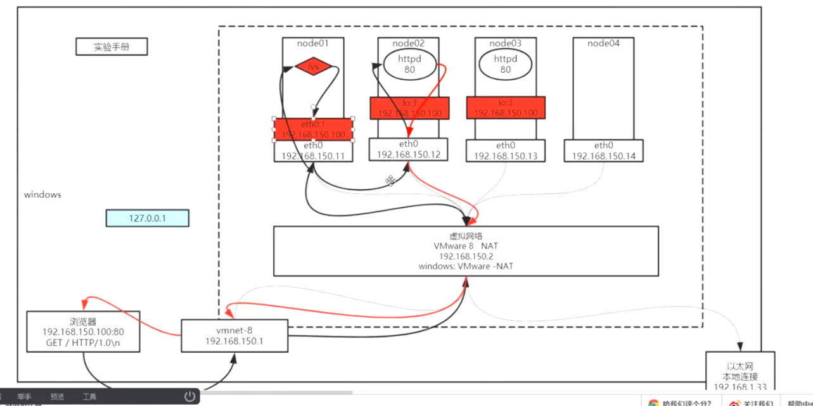

在上图中,VMware8 NAT 服务充当了路由器的角色，它一端连着windows上面的虚拟网卡vmnet-8(192.168.150.1)，另一端连接着Linux虚拟机上的网卡比如192.168.150.11。

以浏览器为例，访问虚拟机上的服务，来验证DR模型的搭建，假设DR模型如上图已搭建完毕,负载规则为轮询：

首先浏览器请求建立一个sokect连接,目的ip端口为192.168.150.100:80,产生一个随机的源端口号，内核会根据路由匹配规则找到对应的网卡192.168.150.1，因此源ip为192.168.150.1,数据包被发送到网卡192.168.150.1，数据包经由这个网卡到达VMware8 NAT服务，VMware8根据路由匹配会将数据包交给192.168.150.100这个网卡所在的主机，

由于配置了DR规则，根据DR规则，数据包将负载到其中一台真实服务器，假设负载到了192.168.150.12,目的mac地址会被LVS修改为192.168.150.12@mac,192.168.150.12机器发现mac匹配，则收下该数据包，接着匹配目的ip地址192.168.150.100,发现匹配到lo:3这块网卡上的隐藏ip，

根据请求端口，匹配到httpd服务，将数据包交给httpd服务，httpd服务返回响应，此时，目标ip为192.168.150.1,根据路由匹配规则，数据包经由192.168.150.12网卡发出，数据包到达VMware8 NAT服务，VMware8 NAT服务根据路由规则将数据包转发给192.168.150.1,由于目标端口为浏览器之前请求的端口号，因此数据包被交给浏览器，然后浏览器与真实服务器建立连接


* 第一步：在node01的eth0号网卡添加上一个子接口，ip配置为vip192.168.150.100

网卡后面跟冒号(:)表示这块网卡的子接口

ifconfig eth01:2 192.168.150.100/24添加ip=

删除ip: ifconfig eth01:2 down删除网卡子接口

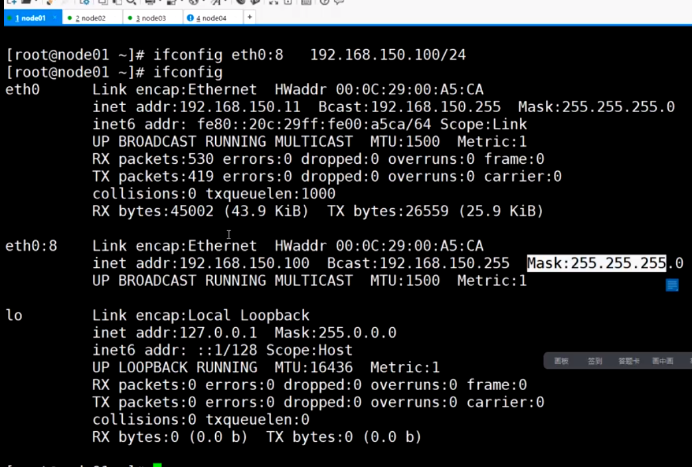

* 第二步：在node02和node03上配置隐藏vip

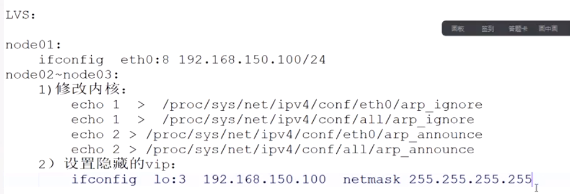

> 1. 修改arp协议，防止隐藏ip被暴露出去,
>
> **注意**：要先修改arp协议再配置隐藏ip，否则ip被通告出去就没法实现隐藏了
>
> 修改arp_ingore的值为1,arp_annouce的值为2
>
> 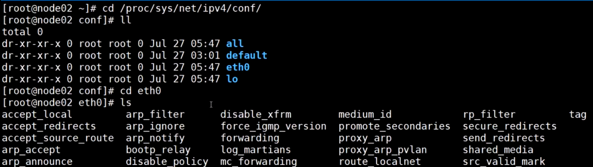
>
> 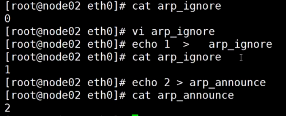
>
> 然后目录往后退一层，修改all接口的arp协议规则
>
> 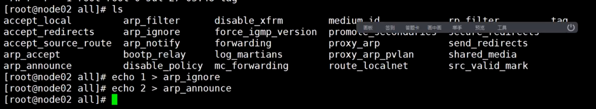
>
> 2.分别配置node02和node03的隐藏vip
>
> ifconfig lo:2 192.168.150.100 netmask 255.255.255.255
>
> **掩码需要配置成4个255,用来规避数据包死循环**，
>
> 例如，如果为子网掩码为255.255.255.0，那么ping 192.168.150.1这个ip，子网掩码和ip作按位与运算得到网络号192.168.150.0，匹配到eth01(192.168.150.12)和lo:2(192.168.150.100)，lo:2为虚拟网卡，离操作系统最近，按照就近原则数据包将被发送给192.168.150.100，lo网卡又会把输出的数据包转换为输入的数据包交给操作系统，从而导致数据包发生死循环，数据包无法向外发送

* 第三步：在node02和node03上安装http,并启动http,给httpd创建一个主页

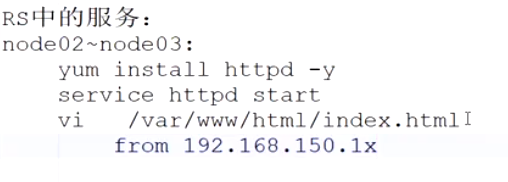

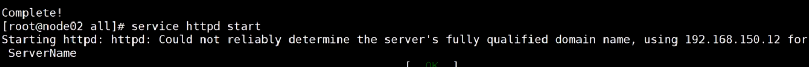

在httpd的默认网站目录/var/www/html/下创建一个index.html页面


* LVS服务配置

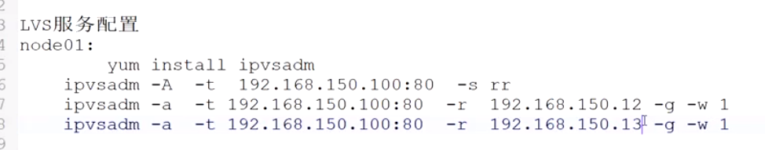

1. 安装ipvs内核模块

yum install ipvsadm -y

2.配置LVS入口规则

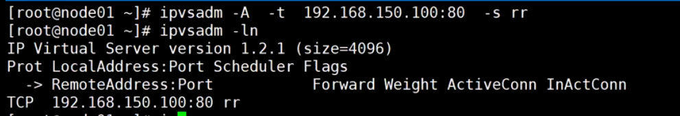

定义集群的真实服务器

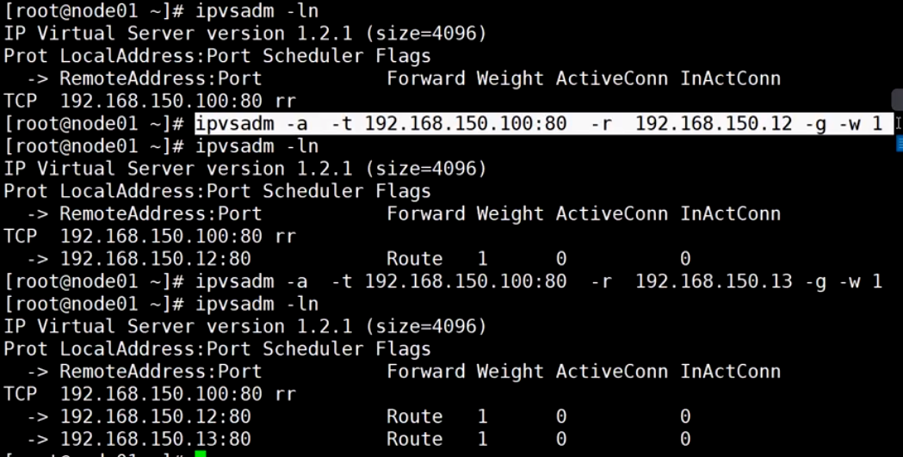

* 验证LVS-DR是否搭建成功

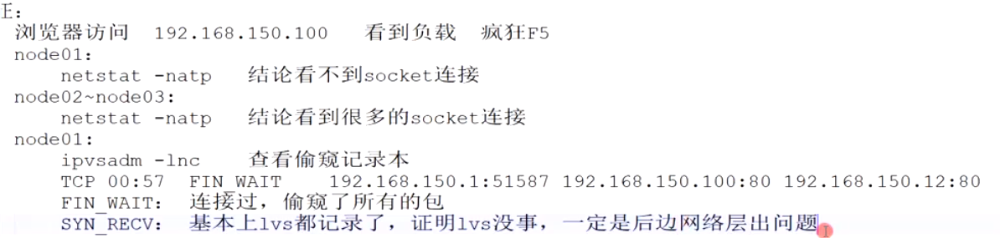

定义完成后规则会立即生效

通过浏览器访问192.168.150.100:80,会发现负载会在192.168.150.12和192.168.150.13之间来回切换

使用netstat -natp查看node01 LVS的连接,看看客户端有没有和LVS直接握手，结果没有发现连接

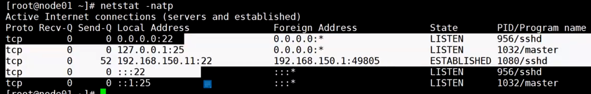

在node02上面验证，有连接建立

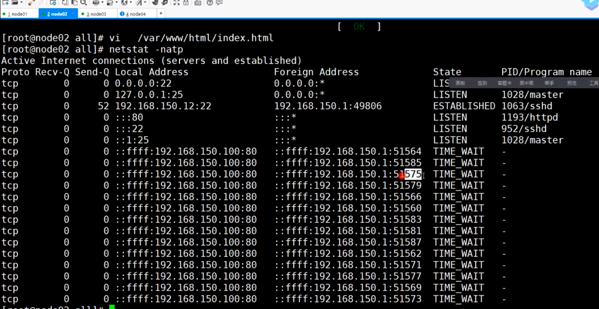

在node01上面查看偷窥的真实服务器建立的连接数:

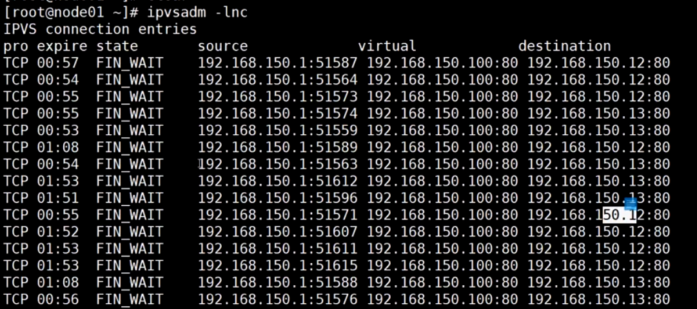

实验：将node02的vip down掉，再通过浏览器访问，发现当负载到02时候不能正常访问，数据包到达node02的时候被丢弃了，因此客户端无法收到node02的确认包,观察node01偷窥的连接状态中有SYN_RECV，说明LVS确实收到了这个数据包,由于后面网络层出现问题所以没法完成三次握手：

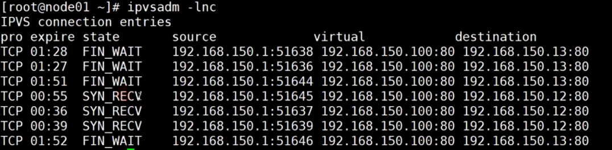

恢复node02的vip配置：
输入history命令，

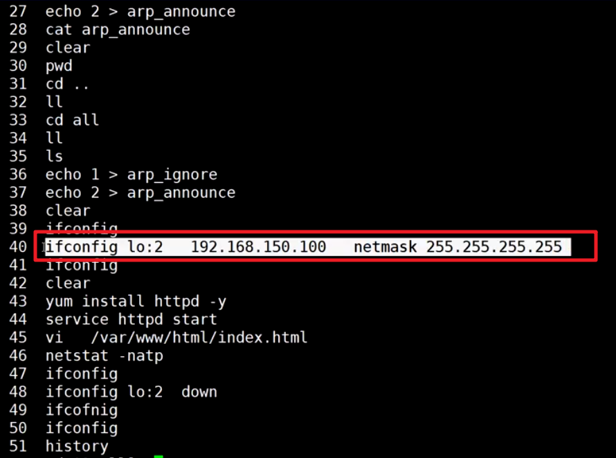

找到之前执行过的命令，再次执行，通过浏览器访问，发现可以正常访问了

```
#node1机器：添加一个vip
[root@centos7 ~]# ifconfig ens33:2 192.168.25.100/24
[root@centos7 ~]# ifconfig
ens33: flags=4163<UP,BROADCAST,RUNNING,MULTICAST>  mtu 1500
        inet 192.168.25.60  netmask 255.255.255.0  broadcast 192.168.25.255
        inet6 fe80::20c:29ff:fe10:b938  prefixlen 64  scopeid 0x20<link>
        ether 00:0c:29:10:b9:38  txqueuelen 1000  (Ethernet)
        RX packets 186  bytes 15749 (15.3 KiB)
        RX errors 0  dropped 0  overruns 0  frame 0
        TX packets 134  bytes 18558 (18.1 KiB)
        TX errors 0  dropped 0 overruns 0  carrier 0  collisions 0

ens33:2: flags=4163<UP,BROADCAST,RUNNING,MULTICAST>  mtu 1500
        inet 192.168.25.100  netmask 255.255.255.0  broadcast 192.168.25.255
        ether 00:0c:29:10:b9:38  txqueuelen 1000  (Ethernet)

lo: flags=73<UP,LOOPBACK,RUNNING>  mtu 65536
        inet 127.0.0.1  netmask 255.0.0.0
        inet6 ::1  prefixlen 128  scopeid 0x10<host>
        loop  txqueuelen 1000  (Local Loopback)
        RX packets 0  bytes 0 (0.0 B)
        RX errors 0  dropped 0  overruns 0  frame 0
        TX packets 0  bytes 0 (0.0 B)
        TX errors 0  dropped 0 overruns 0  carrier 0  collisions 0

virbr0: flags=4099<UP,BROADCAST,MULTICAST>  mtu 1500
        inet 192.168.122.1  netmask 255.255.255.0  broadcast 192.168.122.255
        ether 52:54:00:10:04:fc  txqueuelen 1000  (Ethernet)
        RX packets 0  bytes 0 (0.0 B)
        RX errors 0  dropped 0  overruns 0  frame 0
        TX packets 0  bytes 0 (0.0 B)
        TX errors 0  dropped 0 overruns 0  carrier 0  collisions 0
#node2机器 & node3机器:
[root@node1 conf]# cd eth1
[root@node1 eth1]# ls
accept_local      accept_source_route  arp_announce  arp_ignore  bootp_relay     disable_xfrm        forwarding    mc_forwarding  promote_secondaries  proxy_arp_pvlan  rp_filter         send_redirects  src_valid_mark
accept_redirects  arp_accept           arp_filter    arp_notify  disable_policy  force_igmp_version  log_martians  medium_id      proxy_arp            route_localnet   secure_redirects  shared_media    tag
[root@node1 eth1]# echo 1 > arp_ignore
[root@node1 eth1]# echo 2 > arp_announce
[root@node1 eth1]# cat arp_ignore
1
[root@node1 eth1]# cat arp_announce
2

#添加vip
[root@node1 all]# ifconfig lo:2 192.168.25.100 netmask 255.255.255.255
#node2 & node3安装httpd服务，并启动，为服务添加首页面
[root@node1 yum.repos.d]# yum install httpd -y
#修改httpd启动的ip端口
vim /etc/httpd/conf/httpd.conf
Listen 192.168.25.66:80
#启动httpd
[root@node1 local]# service httpd start
Starting httpd: 
#为httpd添加首页
[root@node1 local]# cd /var/www/html
[root@node1 html]# ls
[root@node1 html]# vim index.html

from 192.168.25.66
#通过浏览器直接访问http://192.168.25.66/
浏览器显示from 192.168.25.66表示成功了

#node1 安装ipvsadm客户端并配置LVS
[root@centos7 ~]# yum install ipvsadm -y
[root@centos7 ~]# ipvsadm -A -t 192.168.25.100:80 -s rr
[root@centos7 ~]# ipvsadm -ln
IP Virtual Server version 1.2.1 (size=4096)
Prot LocalAddress:Port Scheduler Flags
  -> RemoteAddress:Port           Forward Weight ActiveConn InActConn
TCP  192.168.25.100:80 rr
[root@centos7 ~]# ipvsadm -a -t 192.168.25.100:80 -r 192.168.25.66 -g -w 1
[root@centos7 ~]# ipvsadm -a -t 192.168.25.100:80 -r 192.168.25.67 -g -w 1
[root@centos7 ~]# ipvsadm -ln
IP Virtual Server version 1.2.1 (size=4096)
Prot LocalAddress:Port Scheduler Flags
  -> RemoteAddress:Port           Forward Weight ActiveConn InActConn
TCP  192.168.25.100:80 rr
  -> 192.168.25.66:80             Route   1      0          0         
  -> 192.168.25.67:80             Route   1      0          0         

#验证
#然后通过浏览器访问192.168.25.100
from 192.168.25.66
from 192.168.25.67

#查看node2
[root@node1 html]# netstat -natp
Active Internet connections (servers and established)
Proto Recv-Q Send-Q Local Address               Foreign Address             State       PID/Program name   
tcp        0      0 ::ffff:192.168.25.100:80    ::ffff:192.168.25.1:61813   TIME_WAIT   -                   
tcp        0      0 ::ffff:192.168.25.100:80    ::ffff:192.168.25.1:61871   TIME_WAIT   -                   
tcp        0      0 ::ffff:192.168.25.100:80    ::ffff:192.168.25.1:61837   TIME_WAIT   -                   
tcp        0      0 ::ffff:192.168.25.100:80    ::ffff:192.168.25.1:61846   TIME_WAIT   -                   
tcp        0      0 ::ffff:192.168.25.100:80    ::ffff:192.168.25.1:61824   TIME_WAIT   -                   
tcp        0      0 ::ffff:192.168.25.100:80    ::ffff:192.168.25.1:61832   TIME_WAIT   -                   
tcp        0      0 ::ffff:192.168.25.100:80    ::ffff:192.168.25.1:61815   TIME_WAIT   -                   
tcp        0      0 ::ffff:192.168.25.100:80    ::ffff:192.168.25.1:61827   TIME_WAIT   -                   
tcp        0      0 ::ffff:192.168.25.100:80    ::ffff:192.168.25.1:61873   TIME_WAIT   -                   
tcp        0      0 ::ffff:192.168.25.100:80    ::ffff:192.168.25.1:61820   TIME_WAIT   -                   
tcp        0      0 ::ffff:192.168.25.100:80    ::ffff:192.168.25.1:61802   TIME_WAIT   -                   
tcp        0      0 ::ffff:192.168.25.100:80    ::ffff:192.168.25.1:61835   TIME_WAIT   -                   
tcp        0      0 ::ffff:192.168.25.100:80    ::ffff:192.168.25.1:61805   TIME_WAIT   -                   
tcp        0      0 ::ffff:192.168.25.100:80    ::ffff:192.168.25.1:61848   TIME_WAIT   -                   
tcp        0      0 ::ffff:192.168.25.100:80    ::ffff:192.168.25.1:61811   TIME_WAIT   -                   
tcp        0      0 ::ffff:192.168.25.100:80    ::ffff:192.168.25.1:61800   TIME_WAIT   -                   
tcp        0      0 ::ffff:192.168.25.100:80    ::ffff:192.168.25.1:61877   TIME_WAIT   -        
#查看node3
[root@node1 conf]# netstat -natp
Active Internet connections (servers and established)
Proto Recv-Q Send-Q Local Address               Foreign Address             State       PID/Program name   
tcp        0      0 ::ffff:192.168.25.100:80    ::ffff:192.168.25.1:61955   TIME_WAIT   -                   
tcp        0      0 ::ffff:192.168.25.100:80    ::ffff:192.168.25.1:61951   TIME_WAIT   -                   
tcp        0      0 ::ffff:192.168.25.100:80    ::ffff:192.168.25.1:61953   TIME_WAIT   -                   
tcp        0      0 ::ffff:192.168.25.100:80    ::ffff:192.168.25.1:61948   TIME_WAIT   -                   
tcp        0      0 ::ffff:192.168.25.100:80    ::ffff:192.168.25.1:61958   ESTABLISHED 2603/httpd  
#查看node1的连接数
[root@centos7 html]# ipvsadm -lnc
IPVS connection entries
pro expire state       source             virtual            destination
TCP 00:00  FIN_WAIT    192.168.25.1:61851 192.168.25.100:80  192.168.25.66:80
TCP 00:15  FIN_WAIT    192.168.25.1:61877 192.168.25.100:80  192.168.25.66:80
TCP 01:36  FIN_WAIT    192.168.25.1:61949 192.168.25.100:80  192.168.25.66:80
TCP 00:15  FIN_WAIT    192.168.25.1:61874 192.168.25.100:80  192.168.25.67:80
TCP 00:00  FIN_WAIT    192.168.25.1:61853 192.168.25.100:80  192.168.25.66:80
TCP 00:01  FIN_WAIT    192.168.25.1:61856 192.168.25.100:80  192.168.25.67:80
TCP 01:37  FIN_WAIT    192.168.25.1:61955 192.168.25.100:80  192.168.25.67:80
TCP 01:20  FIN_WAIT    192.168.25.1:61880 192.168.25.100:80  192.168.25.66:80
TCP 00:14  FIN_WAIT    192.168.25.1:61871 192.168.25.100:80  192.168.25.66:80
TCP 00:16  FIN_WAIT    192.168.25.1:61878 192.168.25.100:80  192.168.25.67:80
TCP 01:36  FIN_WAIT    192.168.25.1:61951 192.168.25.100:80  192.168.25.67:80
TCP 00:01  FIN_WAIT    192.168.25.1:61857 192.168.25.100:80  192.168.25.66:80
TCP 00:13  FIN_WAIT    192.168.25.1:61868 192.168.25.100:80  192.168.25.66:80
TCP 00:00  FIN_WAIT    192.168.25.1:61849 192.168.25.100:80  192.168.25.67:80
TCP 00:01  FIN_WAIT    192.168.25.1:61855 192.168.25.100:80  192.168.25.66:80
TCP 00:13  FIN_WAIT    192.168.25.1:61870 192.168.25.100:80  192.168.25.67:80
TCP 00:13  FIN_WAIT    192.168.25.1:61858 192.168.25.100:80  192.168.25.67:80
TCP 00:00  FIN_WAIT    192.168.25.1:61852 192.168.25.100:80  192.168.25.67:80
TCP 00:14  FIN_WAIT    192.168.25.1:61872 192.168.25.100:80  192.168.25.67:80
TCP 00:15  FIN_WAIT    192.168.25.1:61873 192.168.25.100:80  192.168.25.66:80
TCP 01:35  FIN_WAIT    192.168.25.1:61948 192.168.25.100:80  192.168.25.67:80
TCP 00:00  FIN_WAIT    192.168.25.1:61854 192.168.25.100:80  192.168.25.67:80
TCP 00:15  FIN_WAIT    192.168.25.1:61876 192.168.25.100:80  192.168.25.67:80
TCP 01:37  FIN_WAIT    192.168.25.1:61953 192.168.25.100:80  192.168.25.67:80
TCP 01:37  FIN_WAIT    192.168.25.1:61952 192.168.25.100:80  192.168.25.66:80
TCP 14:42  ESTABLISHED 192.168.25.1:61958 192.168.25.100:80  192.168.25.67:80
TCP 01:37  FIN_WAIT    192.168.25.1:61954 192.168.25.100:80  192.168.25.66:80
TCP 01:38  FIN_WAIT    192.168.25.1:61956 192.168.25.100:80  192.168.25.66:80
TCP 00:15  FIN_WAIT    192.168.25.1:61875 192.168.25.100:80  192.168.25.66:80
```

```
遇到问题：
解决方法：
vi /etc/yum.repos.d/CentOS-Base.repo

[base]
name=CentOS-6.10 - Base
failovermethod=priority
baseurl=http://vault.centos.org/6.10/os/$basearch/
gpgcheck=1
gpgkey=http://vault.centos.org/RPM-GPG-KEY-CentOS-6

#released updates
[updates]
name=CentOS-6.10 - Updates
failovermethod=priority
baseurl=http://vault.centos.org/6.10/updates/$basearch/
gpgcheck=1
gpgkey=http://vault.centos.org/RPM-GPG-KEY-CentOS-6

#additional packages that may be useful
[extras]
name=CentOS-6.10 - Extras
failovermethod=priority
baseurl=http://vault.centos.org/6.10/extras/$basearch/
gpgcheck=1
gpgkey=http://vault.centos.org/RPM-GPG-KEY-CentOS-6

#additional packages that extend functionality of existing packages
[centosplus]
name=CentOS-6.10 - Plus
failovermethod=priority
baseurl=http://vault.centos.org/6.10/centosplus/$basearch/
gpgcheck=1
enabled=0
gpgkey=http://vault.centos.org/RPM-GPG-KEY-CentOS-6

#contrib - packages by Centos Users
[contrib]
name=CentOS-6.10 - Contrib
failovermethod=priority
baseurl=http://vault.centos.org/6.10/contrib/$basearch/
gpgcheck=1
enabled=0
gpgkey=http://vault.centos.org/RPM-GPG-KEY-CentOS-6


#清空yum缓存
sudo yum clean all && yum makecache
```

