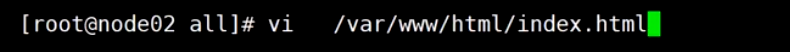

#### LVS隧道模式 TUN

为了解决真实服务器和LVS不在一个局域网的情况，对发往真实服务器的数据包外面再包装一层ip(ip为RIP)，当真实服务器接收到数据包，

将外面的包裹拆掉，就可以正常处理客户端请求了，VPN也是基于这个原理


#### LVS的DR模型试验搭建

##### ARP协议


Linux中把网络设备，进程抽象成为文件，/proc代表进程或者内核所映射出来的目录，/sys代表系统，net代表网络，ipv4代表ipv4协议，\*IF\*代表接口

当修改文件的内容时，相当于修改内核空间的参数或者进程内变量的参数

这个目录下的文件不能使用vi命令修改，原因是vi会产生临时文件，而创建临时文件相当于是在内核空间新增变量，这个操作是不允许的

一块网卡可以配置多个ip地址

arp_ignore:

>0:只要本地配置的有相应地址，就给予响应；比如本地有多个网卡，配置了多个ip，只要是这几个ip中的ip，就返回mac地址
>
>1:仅在请求的目标(mac)地址配置请求到达的接口上的时候，才给予响应；比如本地有多个网卡，配置了多个ip，请求是从网卡1过来的，并且ip地址也匹配，才返回mac地址,如果请求的ip位于网卡2，不会给予响应

arp_announce:

>0:将本地任何接口上的任何地址向外通告; 比如本地有多个网卡，每个网卡上配置了多个ip，请求其中一个ip的mac地址时，返回本地所有的ip的mac地址
>
>1.试图仅向目标网络通告与其网络匹配的地址;比如本地有多个网卡，每个网卡上配置了多个ip，则返回本地与请求的网络匹配的所有ip的mac地址
>
>2.仅向与本地接口上地址匹配的网络进行通告; 比如本地有多个网卡，每个网卡上配置了多个ip，如果请求的是网卡1，网卡1有两个ip，请求的是ip1，则只返回请求ip1的mac地址，不会返回ip2和mac的映射关系

##### 网卡


eth0:物流网卡

lo:虚拟网卡，环回设备,localhost(域名),127.0.0.1,lo网卡不会和外界连通，外界的数据包只能到达物理网卡

**lo网卡是对外隐藏对内可见**

**任何的网络接口(网卡)都可以有子接口**

虚拟网卡的使用:假设本地有Tomcat服务绑定在8080端口,通过浏览器访问tomcat的过程：

浏览器会将请求的数据包发送给操作系统内核，内核做路由判定，ip地址匹配到lo这块网卡，内核将数据包写入lo网卡，lo网卡并不会通过网线向外发送数据包，而是将输出的数据包转换为输入的数据包，输入的数据包被操作系统接收后，根据数据包的端口匹配到Tomcat服务，操作系统将数据包交给Tomcat，Tomcat返回响应的数据包，数据包再经由lo网卡发送给浏览器

##### VIP绑定到真实服务器，对外隐藏对内可见

将vip绑定到lo接口，作为lo的子接口

##### LVS调度算法

静态调度算法：

> rr 轮询  第一个请求负载给第一台服务器，第二个请求负载给下一台服务器，依次类推
>
> wrr 加权轮询，权重高的真实服务器被负载更多
>
> dh
>
> sh

动态调度算法：

> Lc 最少连接  将请求负载给连接少最少的真实服务器
>
> wlc 加权最少连接
>
> sed 最短期望延迟
>
> nq(never queue)
>
> LBLC 基于本地的最少连接
>
> DH
>
> LBLCR 基于本地的带复制功能的最少连接

问题：LVS怎么才能知道每个真实服务器的维护了哪些连接

```
client发送请求到LVS,LVS通过偷窥数据包的内容，发现SYNC标记，则认为客户端请求第一次握手，然后将数据包负载给一台真实服务器，并记录下了客户端请求负载给了哪台真实服务器，真实服务器的响应数据SYNC+ACK包经过(D-NAT)或者不经过(DR)LVS服务器返回给客户端,客户端进行第三次握手经过LVS返回ACK给真实服务器，LVS偷窥到这个数据包后，则认为客户端和真实服务器已经建立了连接，当客户端和真实服务器断开连接则发送挥手的数据包，当LVS收到客户端挥手的数据包后，将连接数减1
```


linux自带LVS模块:ipvs内核模块

ipvsadm: ipvs的客户端，可以用来控制ipvs参数

yum install ipvsadm -y


-A:添加，-s 指定调度规则

##### 实验手册


* 第一步：在node01的eth0号网卡添加上一个子接口，ip配置为vip192.168.150.100

网卡后面跟冒号(:)表示这块网卡的子接口

ifconfig eth01:2 192.168.150.100/24添加ip

删除ip: ifconfig eth01:2 down删除网卡子接口


* 第二步：在node02和node03上配置隐藏vip


> 1. 修改arp协议，防止隐藏ip被暴露出去,
>
> **注意**：要先修改arp协议再配置隐藏ip，否则ip被通告出去就没法实现隐藏了
>
> 修改arp_ingore的值为1,arp_annouce的值为2
>
> 
>
> 
>
> 然后目录往后退一层，修改all接口的arp协议规则
>
> 
>
> 2.分别配置node02和node03的隐藏vip
>
> ifconfig lo:2 192.168.150.100 netmask 255.255.255.255
>
> **掩码需要配置成4个255,用来规避数据包死循环**，
>
> 例如，如果为子网掩码为255.255.255.0，那么ping 192.168.150.1这个ip，子网掩码和ip作按位与运算得到网络号192.168.150.0，匹配到eth01(192.168.150.12)和lo:2(192.168.150.100)，lo:2为虚拟网卡，离操作系统最近，按照就近原则数据包将被发送给192.168.150.100，lo网卡又会把输出的数据包转换为输入的数据包交给操作系统，从而导致数据包发生死循环，数据包无法向外发送

* 第三步：在node02和node03上安装http,并启动http,给httpd创建一个主页


在httpd的默认网站目录/var/www/html/下创建一个index.html页面



* LVS服务配置


1. 安装ipvs内核模块

yum install ipvsadm -y

2.配置LVS入口规则


定义集群的真实服务器


* 验证LVS-DR是否搭建成功


定义完成后规则会立即生效

通过浏览器访问192.168.150.100:80,会发现负载会在192.168.150.12和192.168.150.13之间来回切换

使用netstat -natp查看node01 LVS的连接,看看客户端有没有和LVS直接握手，结果没有发现连接


在node02上面验证，有连接建立


在node01上面查看偷窥的真实服务器建立的连接数:


实验：将node02的vip down掉，再通过浏览器访问，发现当负载到02时候不能正常访问，数据包到达node02的时候被丢弃了，因此客户端无法收到node02的确认包,观察node01偷窥的连接状态中有SYN_RECV，说明LVS确实收到了这个数据包,由于后面网络层出现问题所以没法完成三次握手：


恢复node02的vip配置：
输入history命令，


找到之前执行过的命令，再次执行，通过浏览器访问，发现可以正常访问了

