Nginx七层反向代理示意图：

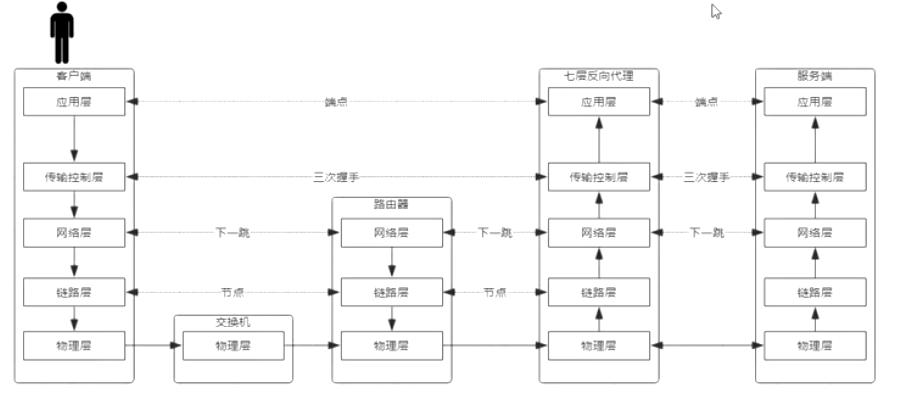

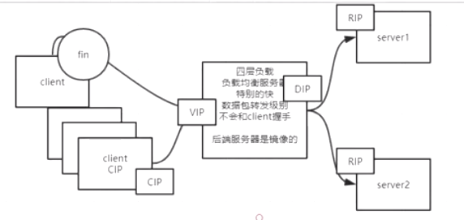


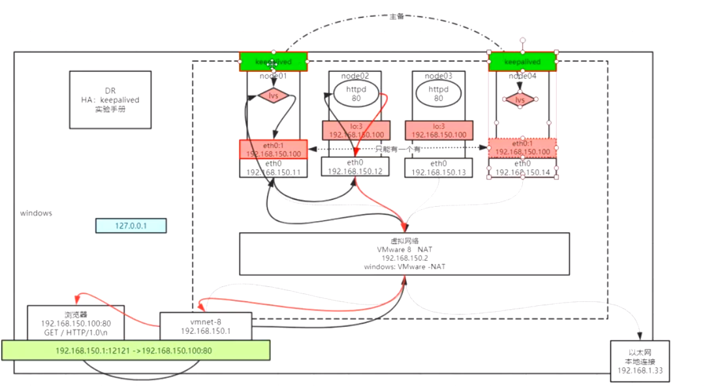

#### keepalive搭建

1. 清空node01上面的lvs配置和vip网卡配置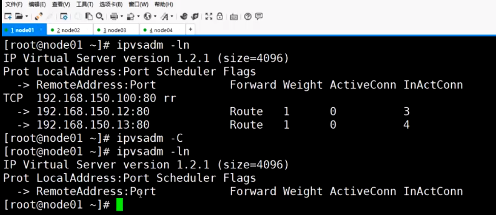

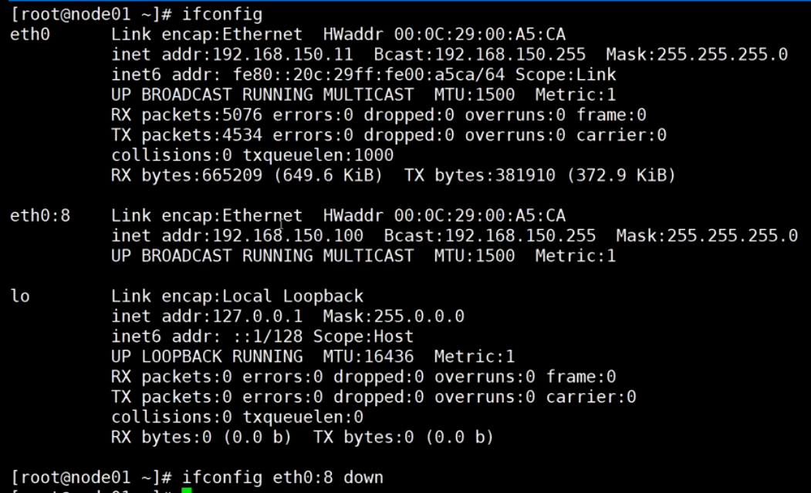

2.在node01和node04上面安装keepalive,并添加配置文件

安装keepalived和ipvsadm

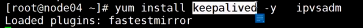

配置文件目录：/etc/keepalived，先备份配置文件

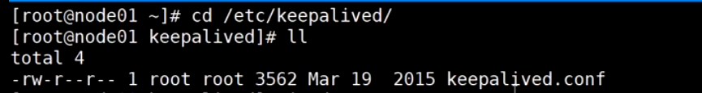

修改配置文件：vi keepalived.conf

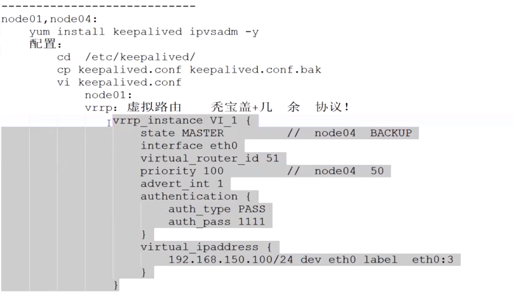

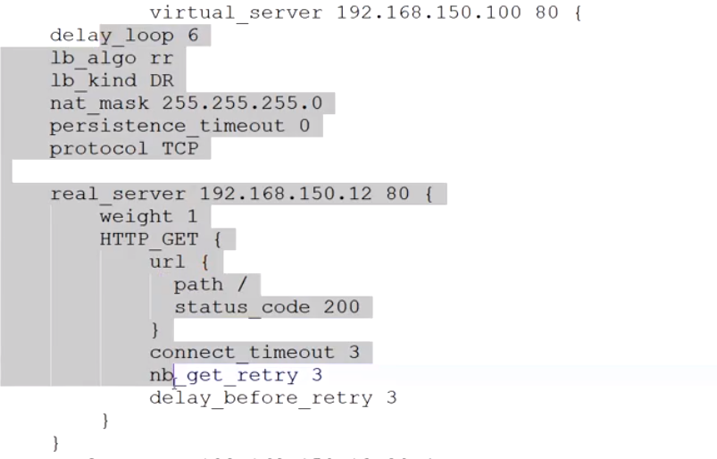

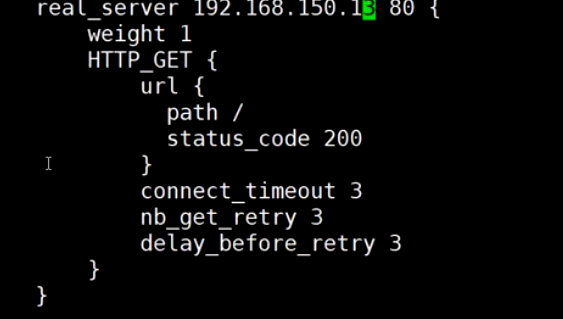

全局配置：可以做邮件通知

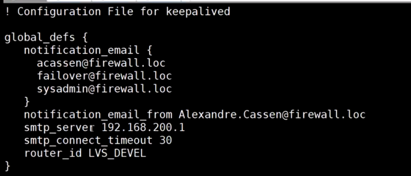

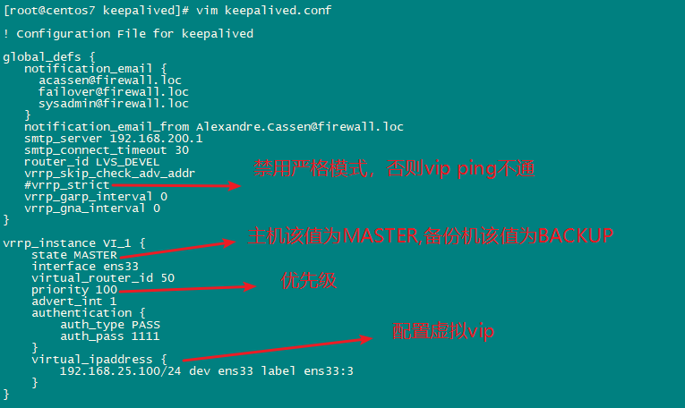

虚拟路由冗余协议：

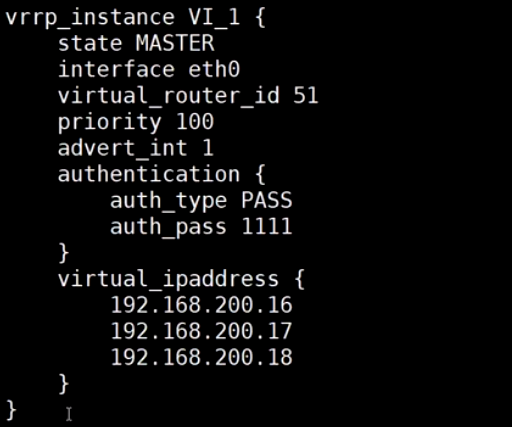

服务器通常会使用多个网卡，不同类型的数据包走不同的网络，这样即使其中一个网络瘫痪，其他网络还可以正常使用

虚拟服务器：


查看帮助手册：

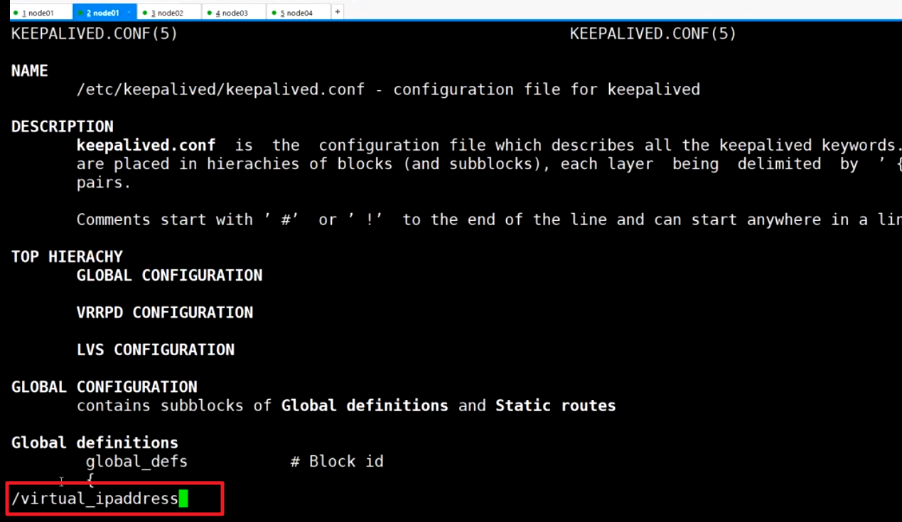

继续编辑conf，配置vip

```
vi
3dd:删除三行,O:新建一行
```


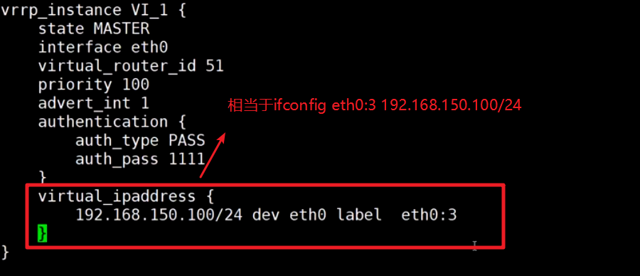

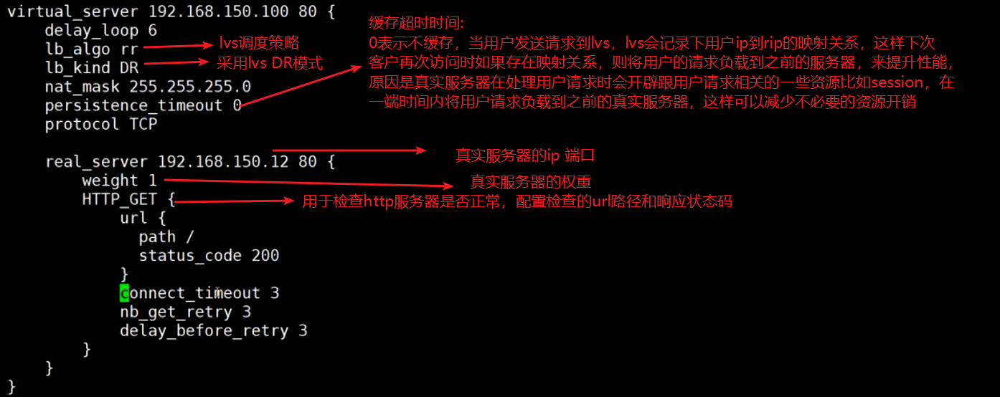

```
vi:
dG:删除光标到文档尾部的内容

: .,$-1y，点表示光标所在的位置，$-1代表倒数第二行,y代表复制，这行命令的作用是复制到光标所在处到倒数第二行的内容

光标切换到需要粘贴的位置，按k粘贴

r:修改某个字符
```

scp:远程拷贝配置文件从node01到node04

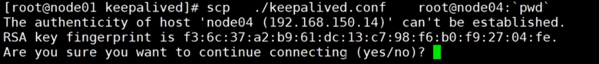

3.启动node01和node04的keepalived

启动**node01**的keepalived


发现keepalived已经把网卡配置好了

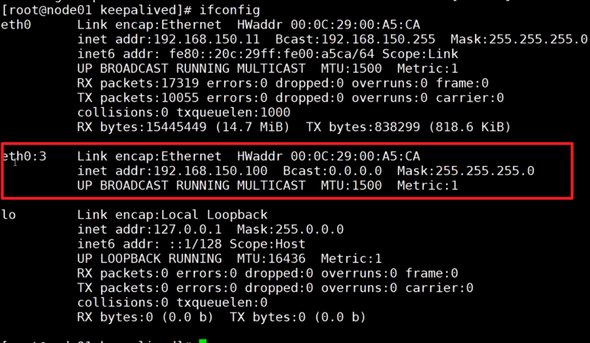

发现keepalived已经把lvs配置好了

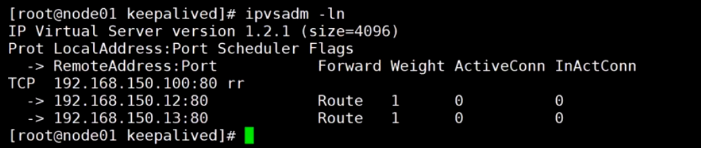

尝试通过浏览器访问lvs,发现负载均衡可以了

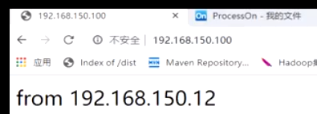

使用ipvsadm偷窥数据包，发现数据包已经被记录下来了


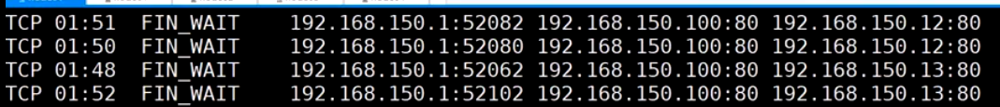

启动**node04***的keepalived:

发现，vip网卡被没有被配置，原因是node04是备份机

检查ipvs配置，发现ipvs配置已经好了，原因是ipvs需要维护有效的真实服务器列表，这样可以在主机宕机后很好地接管主机的工作

检查是否有数据包，发现并没有数据包到达node04

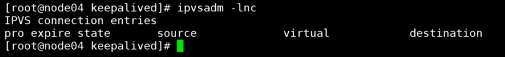

4.模拟主机宕机

将物理网卡down掉，这样物理网卡的子接口也同时被down掉


尝试通过浏览器访问lvs,发现备份机开始工作了


当主机恢复正常，发现node01已经抢回主机的位置了，node04继续作为备份机等待

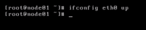

node01是否要抢主机的位置，取决于抢回主机的成本：如果抢回主机需要同步大量数据，则不适合抢回主机

5.模拟真实服务器宕机

将node02的httpd服务停掉

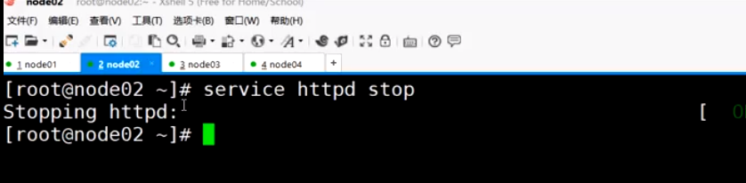

发现node01和node04的Lvs维护的真实服务器列表已经把node02剔除了

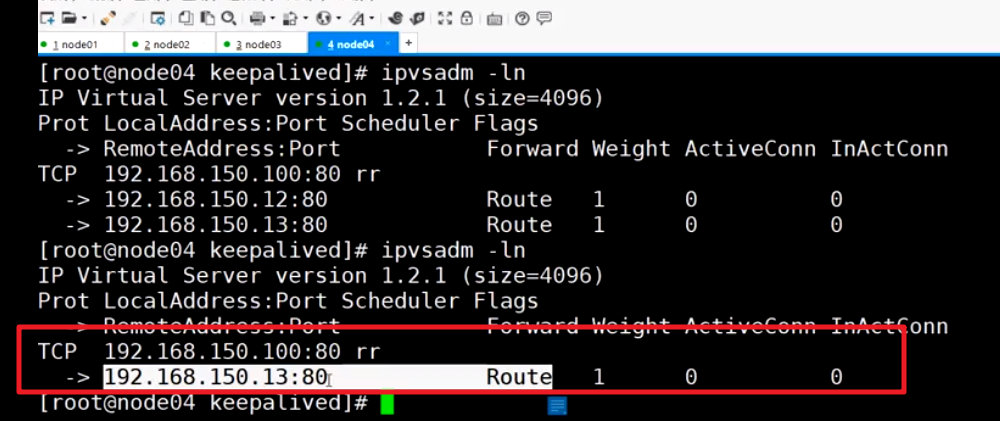

将node02的httpd服务启动

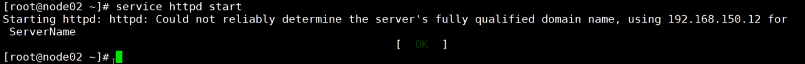

发现node02又被加入到node01和node04的lvs列表中了

6.keepalived如果宕机怎么办？

查看keepalived的进程：

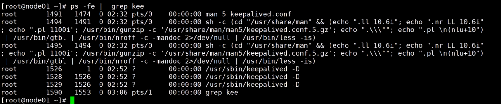

发现有三个keepalived进程，一个主进程，两个子进程

杀掉三个keepalived进程：

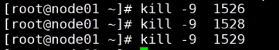

发现node04和node01都配置了vip，会导致数据包混乱

解决方法：使用zookeeper集群方式

```shell
#node1:
[root@centos7 keepalived]# vim keepalived.conf 
global_defs {
   notification_email {
     acassen@firewall.loc
     failover@firewall.loc
     sysadmin@firewall.loc
   }
   notification_email_from Alexandre.Cassen@firewall.loc
   smtp_server 192.168.200.1
   smtp_connect_timeout 30
   router_id LVS_DEVEL
   vrrp_skip_check_adv_addr
   #vrrp_strict
   vrrp_garp_interval 0
   vrrp_gna_interval 0
}

vrrp_instance VI_1 {
    state MASTER
    interface ens33
    virtual_router_id 50
    priority 100
    advert_int 1
    authentication {
        auth_type PASS
        auth_pass 1111
    }
    virtual_ipaddress {
        192.168.25.100/24 dev ens33 label ens33:3
    }
}

virtual_server 192.168.25.100 80 {
    delay_loop 6
    lb_algo rr
    lb_kind DR
    persistence_timeout 0
    protocol TCP

    real_server 192.168.25.66 80 {
        weight 1
        HTTP_GET {
            url {
              path /
              status_code 200
            }
            connect_timeout 3
            nb_get_retry 3
            delay_before_retry 3
        }
    }
    real_server 192.168.25.67 80 {
        weight 1
        HTTP_GET {
            url {
              path /
              status_code 200
            }
            connect_timeout 3
            nb_get_retry 3
            delay_before_retry 3
        }
    }
}
~
~
~   
"keepalived.conf" 67L, 1316C written                                                                                                                                                                                       
[root@centos7 keepalived]# ls
keepalived_bak.conf  keepalived.conf
[root@centos7 keepalived]# scp keepalived.conf root@node4:`pwd`
ssh: Could not resolve hostname node4: Name or service not known
lost connection
[root@centos7 keepalived]# scp keepalived.conf root@192.168.25.69:`pwd`
The authenticity of host '192.168.25.69 (192.168.25.69)' can't be established.
ECDSA key fingerprint is SHA256:lRgmfHHi1a4UNOjMMubplq1KuSs1Aes1DPCNfti/Re0.
ECDSA key fingerprint is MD5:c0:22:aa:bb:1e:66:3b:ba:75:c3:44:49:43:14:4f:0f.
Are you sure you want to continue connecting (yes/no)? yes
Warning: Permanently added '192.168.25.69' (ECDSA) to the list of known hosts.
root@192.168.25.69's password: 
keepalived.conf                                                                                                                                                                                            100% 1316   632.1KB/s   00:00    
[root@centos7 keepalived]# 
```

```shell
#node4:
[root@centos7 keepalived]# vim keepalived.conf 
global_defs {
   notification_email {
     acassen@firewall.loc
     failover@firewall.loc
     sysadmin@firewall.loc
   }
   notification_email_from Alexandre.Cassen@firewall.loc
   smtp_server 192.168.200.1
   smtp_connect_timeout 30
   router_id LVS_DEVEL
   vrrp_skip_check_adv_addr
   #vrrp_strict
   vrrp_garp_interval 0
   vrrp_gna_interval 0
}

vrrp_instance VI_1 {
    state BACKUP
    interface ens33
    virtual_router_id 51
    priority 50
    advert_int 1
    authentication {
        auth_type PASS
        auth_pass 1111
    }
    virtual_ipaddress {
        192.168.25.100/24 dev ens33 label ens33:3
    }
}

virtual_server 192.168.25.100 80 {
    delay_loop 6
    lb_algo rr
    lb_kind DR
    persistence_timeout 0
    protocol TCP

    real_server 192.168.25.66 80 {
        weight 1
        HTTP_GET {
            url {
              path /
              status_code 200
            }
            connect_timeout 3
            nb_get_retry 3
            delay_before_retry 3
        }
    }
    real_server 192.168.25.67 80 {
        weight 1
        HTTP_GET {
            url {
              path /
              status_code 200
            }
            connect_timeout 3
            nb_get_retry 3
            delay_before_retry 3
        }
    }
}
~
~
~   
"keepalived.conf" 67L, 1316C written                                                                                                                                                                                       
[root@centos7 keepalived]# ls
keepalived_bak.conf  keepalived.conf
[root@centos7 keepalived]# scp keepalived.conf root@node4:`pwd`
ssh: Could not resolve hostname node4: Name or service not known
lost connection
[root@centos7 keepalived]# scp keepalived.conf root@192.168.25.69:`pwd`
The authenticity of host '192.168.25.69 (192.168.25.69)' can't be established.
ECDSA key fingerprint is SHA256:lRgmfHHi1a4UNOjMMubplq1KuSs1Aes1DPCNfti/Re0.
ECDSA key fingerprint is MD5:c0:22:aa:bb:1e:66:3b:ba:75:c3:44:49:43:14:4f:0f.
Are you sure you want to continue connecting (yes/no)? yes
Warning: Permanently added '192.168.25.69' (ECDSA) to the list of known hosts.
root@192.168.25.69's password: 
keepalived.conf                                                                                                                                                                                            100% 1316   632.1KB/s   00:00    
[root@centos7 keepalived]# 
```

```
问题：
keepalived.conf中vip配置好后，通过ip addr可以看到vip已经顺利挂载，但是无法ping通，并且防火墙都已关闭
解决办法：
原因是keepalived.conf配置中默认vrrp_strict打开了，需要把它注释掉。重启keepalived即可ping通。
```

```
查看linxu系统日志:
tail -f /var/log/messages

```

```
注意：httpd服务需要配置多个监听ip地址，否则无法正常访问
node3:
Listen 192.168.25.100:80
Listen 192.168.25.67:80
Listen localhost:80
node2:
Listen localhost:80
Listen 192.168.25.66:80
Listen 192.168.25.100:80
```

