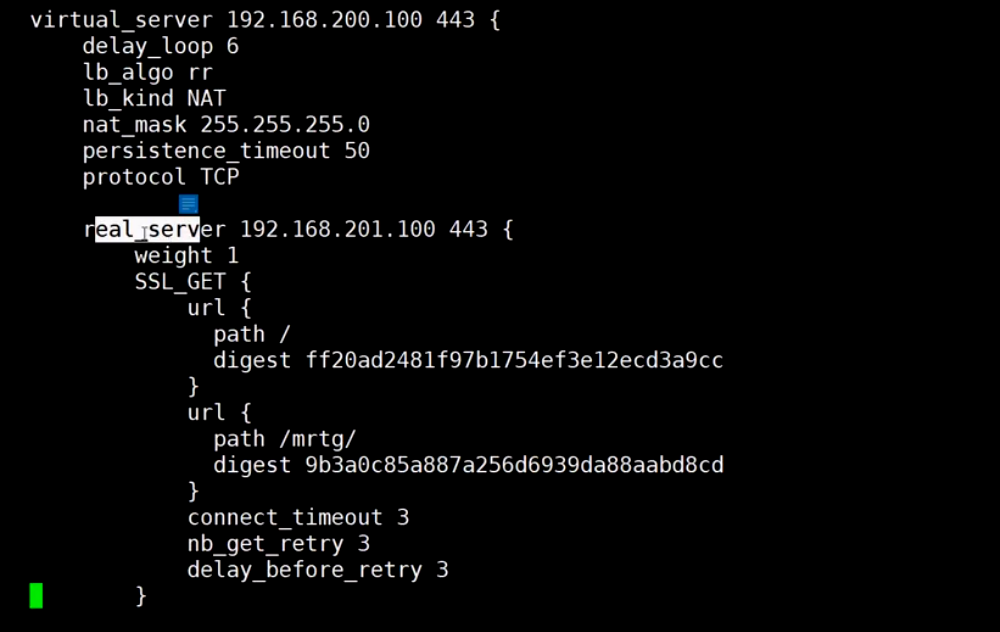
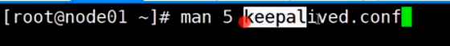
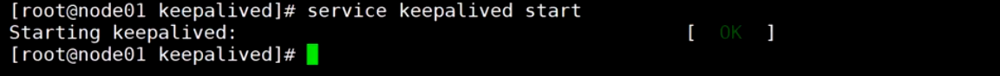
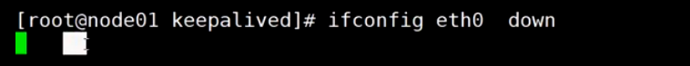

Nginx七层反向代理示意图：


#### keepalive搭建

1. 清空node01上面的lvs配置和vip网卡配置


2.在node01和node04上面安装keepalive,并添加配置文件

安装keepalived和ipvsadm


配置文件目录：/etc/keepalived，先备份配置文件


修改配置文件：vi keepalived.conf


全局配置：可以做邮件通知


虚拟路由冗余协议：


服务器通常会使用多个网卡，不同类型的数据包走不同的网络，这样即使其中一个网络瘫痪，其他网络还可以正常使用

虚拟服务器：



查看帮助手册：


继续编辑conf，配置vip

```
vi
3dd:删除三行,O:新建一行
```


```
vi:
dG:删除光标到文档尾部的内容

: .,$-1y，点表示光标所在的位置，$-1代表倒数第二行,y代表复制，这行命令的作用是复制到光标所在处到倒数第二行的内容

光标切换到需要粘贴的位置，按k粘贴

r:修改某个字符
```

scp:远程拷贝配置文件从node01到node04


3.启动node01和node04的keepalived

启动**node01**的keepalived



发现keepalived已经把网卡配置好了


发现keepalived已经把lvs配置好了


尝试通过浏览器访问lvs,发现负载均衡可以了


使用ipvsadm偷窥数据包，发现数据包已经被记录下来了


启动**node04***的keepalived:

发现，vip网卡被没有被配置，原因是node04是备份机

检查ipvs配置，发现ipvs配置已经好了，原因是ipvs需要维护有效的真实服务器列表，这样可以在主机宕机后很好地接管主机的工作

检查是否有数据包，发现并没有数据包到达node04


4.模拟主机宕机

将物理网卡down掉，这样物理网卡的子接口也同时被down掉



尝试通过浏览器访问lvs,发现备份机开始工作了


当主机恢复正常，发现node01已经抢回主机的位置了，node04继续作为备份机等待


node01是否要抢主机的位置，取决于抢回主机的成本：如果抢回主机需要同步大量数据，则不适合抢回主机

5.模拟真实服务器宕机

将node02的httpd服务停掉


发现node01和node04的Lvs维护的真实服务器列表已经把node02剔除了


将node02的httpd服务启动


发现node02又被加入到node01和node04的lvs列表中了

6.keepalived如果宕机怎么办？

查看keepalived的进程：


发现有三个keepalived进程，一个主进程，两个子进程

杀掉三个keepalived进程：


发现node04和node01都配置了vip，会导致数据包混乱

解决方法：使用zookeeper集群方式

